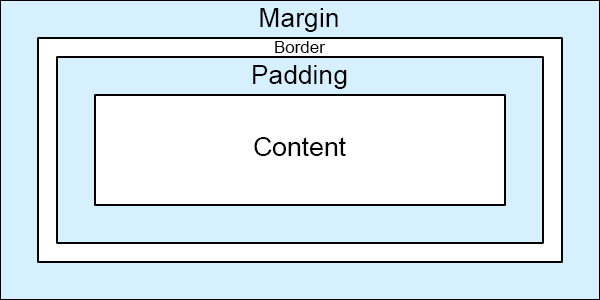

HTML+CSS Tutorial
=================

### Who

I'm Cassidy. I'm a engineer and I've been teaching myself HTML, CSS, and other web development and scripting for over 15 years.
And I want to teach you now.
Because you're good looking.
And because it's useful.

### What

In this tutorial, we'll start from the very beginning.  You don't need to know anything about HTML and CSS or anything about code to start.  I'll include some tutorial files for you to play with and check out.

### When

Now.  Or whenever.  I'm not planning on taking this down anytime soon.  But you are only limited by your own schedule.  Or set free by it.  Whatever.

### Where

On a computer.  Here.

### Why

Because this stuff is important.  Whether you're a business person formatting your emails, an aspiring web designer wanting to get your feet wet, or just someone who is interested and hasn't tried any sort of coding, scripting, or programming before, **HTML and CSS are an essential part** of your learning curve.

## Table of Contents
 * [HTML](https://github.com/cassidoo/HTML-CSS-Tutorial#html-time-lets-go)
	* Editors
	* Tag Structure
	* Text Structure
	* Links
	* Other tags
		* Images
		* Line Breaks
		* Tables
	* Making Things Gorgeous The Wrong Way
		* Colors
		* Width and Height
		* Borders
		* Text Styles
	* The `<head>` tag
	* Putting it all together so far
 * [CSS](https://github.com/cassidoo/HTML-CSS-Tutorial#css-is-magical-and-now-youre-gonna-learn-it)
	* Classes and IDs and other Segregation
		* Classes
		* IDs
		* Other Segregation
			* The `<span>` tag
			* The `<div>` tag
				* Background color
				* Floating
				* Positioning
				* Margins and Padding
				* Z-Index
	* The `<link>` Tag, Comments, and other Developer Joys
		* The `<link>` tag
		* Commenting
			* HTML Comments
			* CSS Comments
		* Other Developer Joys
			* Forms
			* HTML5 and CSS3
			* How To Meet Losers (Get it? HTML Jokes are the best...)        
 * [Final Project!](https://github.com/cassidoo/HTML-CSS-Tutorial#final-project)
 * And now, the end is near

## HTML Time. Let's Go.

### Editors

So the first thing you'll need is an editor to edit your jazz.  There's tons of options out there.

 * Notepad/TextEdit (that's right, the stupid thing that comes on your computer) - This is about as basic as you can get. It's totally okay if you want to use this, but I recommend one of the editors below just so you can see code highlighting (which will help you out later on). But, if you want to be a purist, this'll work just fine.
 * [Visual Studio Code](https://code.visualstudio.com/) - This is what I typically use. It's open source and has TONS of extensions available.
 * [Sublime Text](https://www.sublimetext.com/) - This is a pretty popular option. Very clean interface.
 * [CodePen Projects](https://codepen.io/project) - This is an in-browser code editor, so you can code directly within the web browser, no downloads required. :)
 * [Glitch](https://glitch.com/) - This is another in-browser code editor. It is meant for larger projects, but it's nice to not have to download anything!
 * [Notepad++](http://notepad-plus-plus.org/) - This is just one step up from Notepad. But it's pretty dece.  Code highlighting is in it, and nothing else too fancy, which is what I like about it.

There's a bunch of others [listed here](http://en.wikipedia.org/wiki/List_of_HTML_editors), I just listed the ones I've used and liked!

### HTML Tag Structure

Here is a barebones HTML page, about as simple as you can get. You can open it up in the **1 - Structure** folder in the file part1.html. If you were to open the file in your favorite browser (which you can do, go ahead), you'll see a plain webpage with the title "My Website" and the words, "Hello, World!" written on the page.

```html
<!doctype html>
<html>
	<head>
		<title>
			My Website
		</title>
	</head>
	<body>
		Hello, World!	
	</body>
</html>
```

So, what are we looking at here?
HTML, short for *HyperText Markup Language*, consists of these things called tags, which are words written between `<` and `>` characters, like `<sometag>`.  All tags (with just a few exceptions that we'll talk about later) have a matching closing tag, which has the same name as the opening tag, except that it contains `/` after the first `<`, like `</sometag>`. 

For example, `<html>` is one tag and the closing tag for it is `</html>`, same with `<head>` and `</head>` and `<body>` and `</body>`, and so on.  You get it.
The opening and closing tags together are an *element* (which also includes everything written in it).  For example, `<title>My Website</title>` is one element.  The text inside an element, in the title case, `My Website`, is called the *content* of an element.

Tags organize your page and tell the browser what your page consists of.  There's tons of tags out there, some that you may never use.  
Here's some lists of tags if you really care to see all of them at this point:
 * [HTML Dog Tag List](https://www.htmldog.com/references/html/tags/)
 * [W3Schools Tag List](https://www.w3schools.com/tags/default.asp)
 * [Quackit HTML Tag List](https://www.quackit.com/html/tags/)

So, if you look at our example, you can also put tags inside other tags (like we did with the `<title>` tags inside the `<head>` tags).  This is called *nesting* elements.
In this case, we would say that the `<head>` *contains* the `<title>`.  Sometimes when you have a lot of nested tags, it's hard to keep track, so you have to format your code with spacing, as shown.  Typically, inner tags are spaced more than their outer tags (just as `<title>` is indented further than `<head>`).

Let's take a look again at part1.html in the **1 - Structure** folder.  You'll notice that the first line has `<!doctype html>`.  Every HTML document and website has to have this special tag, as it tells the browser what language we're using.  This is one of those special tags I mentioned that doesn't need a closing tag.

On the second line, you can see a `<html>` tag.  Everything in the website is contained by this tag, and the last line of your entire document will always be `</html>`.

Inside `<html>`, there are two elements: `<head>`and `<body>`. Contained in `<head></head>`, we will put all kinds of information for the browser that the user doesn't necessarily need to see.  For now, we just have `<title>`. The content of `<title>` will be used for the name of the tab of the browser, and also by search engines. 

On the other side of the planet, we have `<body></body>`.  Everything visible to the user is contained in these tags.  Right now, all that consists of is "Hello, World!"  Let's change that for fun.  Replace "Hello, World!" with your own text in your favorite HTML editor, and then open the page in your browser.  Neat!

### Structuring text

Let's get juicy.  We're going to talk about some new tags for structuring your text.  Because you're not going to want just one style of text throughout your whole website, right?

Check out part2.html in the **1 - Structure** folder.  The tags that we'll be talking about here are `<h1>`, `<p>`, `<ul>`, and `<li>`.  Open the file in the browser to try and understand what the heck is going on. 

Now, let's talk about it.

First, we have `<h1>`, which adds a *heading* to our website.  Basically, a heading is just text with a bigger font.  But still.  Important. We'll soon learn how to adjust any and all font sizes, but not yet.  Just know that your headings should be in `<h1>` tags.  Also, if you have a smaller heading, or *sub-heading*, you could use `<h2>`, which is smaller than `<h1>`, but bigger than regular text.  You can keep going with more numbers until you reach `<h6>`, with each heading a bit smaller than the previous.  Try adding some subheadings underneath our current heading!

Next, we have `<p>` tags.  `<p>` adds a *paragraph* of text to our website, which are blocks of text that have some space before and after them.  Edit the text in the paragraphs given, and add your own to see what I mean!

And finally, we have `<ul>`.  `<ul>` means a bulleted list (also known as an *unordered list*), where every `<li>` is an item in that list (called a *list item*). But what if you want a numbered list?  You could change `<ul>` to `<ol>` (and don't forget its closing tag), it's that simple!  `<ol>` is an *ordered list*, which has numbers instead of bullet points, and that is truly the only difference.  Add some list items (`<li>`) to the list (make sure you stay inside the `<ul>` tags), and then change your `<ul>` tags to `<ol>`!

### Links

Links are what makes the world/Internet go 'round.  Seriously.  So, let's learn about them.

Links are made with the `<a>` tag, which stands for *anchor*.  

Open up the **2 - Tags** folder, and add this piece of code right after your heading in page1.html:

```html
<p>This paragraph <a href="http://www.lalalalalalalalalalalalalalalalalala.com/">has a totally awesome link.</a></p>
```

Open page1.html in a browser and click on it!  BEAUTIFUL.

Okay, so let's take a look at this.  First of all, you can see the `<a>` tag there contained in the paragraph.  Beautiful.
But what's that funky milk `href=`?  Well, that syntax called an *attribute*.  Attributes change the way a tag works, and are not visible to the website's user.  You only add attributes to the opening tag, not a closing tag.  Tags can have multiple attributes, for example:

```html
<tag attribute="value1" attribute2="value2">Content of tag</tag>`
```

Got it?  Good.  You're so good looking.

So, anyway, the attribute 'href' tells us where the link is going to go when the user clicks on it (and for those curious, it stands for *hyperreference*).  Try adding some more links to the page to different websites!  

Also, one thing you should note:  Links don't have to be in `<p>` tags like I put above.  You could put them in `<li>` tags in a list, `<h1>` tags for a linking header, or completely on their own!

#### Adding links to other pages in your website
Let's just say you have a fully functioning website called fakewebsite.com.  You have your homepage and your "Contact Us" page in the same directory or folder.

Normally when a beginner links to different pages on their website, they just make links that look like `<a href="http://www.fakewebsite.com/index.htmL">Home</a>` and `<a href="http://www.fakewebsite.com/contactus.htmL">Contact Us</a>`.

This is okay.  BUT, you can do better.  So, what if you change your domain name to reallyfakewebsite.com?  When you edit your HTML, you'd have to edit every single one of the links to match the new domain.  That's gross.  There is a better way.

When you make a link to a page within your own directory or folder on your website, instead of putting in the whole URL, put in something more like this:

```html
<a href="page2.html">Click here to go back to Page 2.</a>
```

Paste this line of code into page1.html.  Watch the magic happen.

Now, if you were to change your domain or location of your files, you don't have to change a thing.  Boo yah.

### Other tags

So, you can reference the links that I showed you before if you want to check out some jazzy stuff you can do with your page.  There are some other ones though that you might want to see before we move on to cooler and bigger things.

#### Images
``. Let's just say you want to put an image on your website.  This is probably a good tag to know.  
Add the following to page1.html:

```html

```

Open up the page in a browser.  WHOA.  Image!  So, the `` tag is one of those special tags.  First of all, it doesn't have a closing tag.  You just stick in a `/` at the end of the one tag and you're done.  Secondly, it also has a `src` attribute (which is short for *source*), and in the value of that attribute you put the URL of the image (similar to `href` in the anchor tag).

One attribute that might be good for you to remember for `` tags is the `alt` attribute.  If you changed the code above to:

```html

```

When you load the page in the browser, the image looks the same.  But, if you roll your mouse over the image, you'll see some words appear!  WOW.  That's the `alt` attribute.  It stands for the *alternate text* for an image, and it's used when a user can't view the image for whatever reason (using a screen reader, slow connection, error in the `src` attribute, etc.).  Or, in the case of [XKCD](http://xkcd.com/), it's used to add more humor to the page (roll your mouse over all of the comics on the site, they always add another joke or two that a lot of people don't know about).

#### Line breaks
Let's just say you want to keep all your content in one paragraph `<p>`, but you still want to break it up.

That's easy.

So, there's two special tags here, `<hr>` and `<br>`.  They are *empty tags*, meaning they have no closing tag.

`<hr>` stands for *horizontal rule*, and creates a visible line break.
`<br>` is a simple line break, all it does is split your paragraph up.

Try inserting these in between some of your `<p>` tags to try it out!

#### Tables
Tables are really cool.  They can also be a bit confusing.  Open up tables.html (in the **2 - Tags**  folder) in a browser to check out the example table I made for you there.

There's several tags for tables, but the essential ones are `<table>`, `<tr>`, `<th>`, and `<td>`.  Look at tables.html in your editor.

We're going to make our own table again on this page.  You can delete the one I made for you, or just make one underneath the current one there.

So, to create a table, you start with the `<table>` tag.  Simple enough.
	
This will contain all the parts of your table.  Sometimes, tables have a `border` attribute that will equal some value for the thickness of the table's border (it's proper to have just "1" or nothing, for reasons we'll explain later).  Go ahead and add one so it looks like this:

```html
<table border="1">
</table>
```

Boom.  Let's add some more.

The next tag we're gonna check out is `<tr>`, which is for a *table row*.  Easy peasy.  So, let's add 3 `<tr>` tags to our table.

```html
<table border="1">
	<tr>
	</tr>
	<tr>
	</tr>
	<tr>
	</tr>
</table>
```

And finally, we have the actual cells of the table.  There are two types of tags for this, `<th>` (*table header*) and `<td>` (*table data*).  As their names indicate, the former is for the header of the table and the latter is for all of the data in the table.

In our first set of `<tr>` tags, add 4 `<th>` tags, and in the second and third `<tr>` tags add 4 `<td>` tags.

```html
<table border="1">
	<tr>
		<th></th>
		<th></th>
		<th></th>
		<th></th>
	</tr>
	<tr>
		<td></td>
		<td></td>
		<td></td>
		<td></td>
	</tr>
	<tr>
		<td></td>
		<td></td>
		<td></td>
		<td></td>
	</tr>
</table>
```
	
Alright!  Our table is all set up.  We have a table with a `border=1` attribute, 3 rows, and 4 columns.  Let's populate it with data so you can see a proper application of the `<table>` tag:

```html
<table border="1">
	<tr>
		<th>Item</th>
		<th>Quantity</th>
		<th>Rate</th>
		<th>Cost</th>
	</tr>
	<tr>
		<td>Candy</td>
		<td>10</td>
		<td>$.50</td>
		<td>$5.00</td>
	</tr>
	<tr>
		<td>Toothpaste</td>
		<td>2</td>
		<td>$3.00</td>
		<td>$6.00</td>
	</tr>
</table>
```
	
Open the page in a browser and check out your work.  Nice job!  I'm truly impressed.  Go eat something good and fattening.

One other fun thing you can try playing with are the `colspan` and `rowspan` attributes.  If you add `colspan="2"` (or `rowspan`, or any other number) into a `<th>` or `<td>` tag, the cell will expand past their cell size.  For example, `<th colspan="2">` will give you a table header that spans 2 columns, and `<td rowspan="3">` will yield a cell that is the height of 3 rows.  Jazzy!

You can also nest tables, but I won't get into that right now.  If you want to play around with the code, try adding some `<tr>` and `<td>` tags inside your current `<td>` tags.  MaGiCal ThInGs.

### Making Things Gorgeous The Wrong Way

So, your website right now looks pretty bland, and that's normal.  But, we want a website that is hot, sexy, ravishing, and powerful.  Yes, that's right, we want a website just like you.

So first, I will show you the wrong way to style your pages.  You might ask why, but trust me, if you learn in this order, you'll understand HTML attributes a lot better, and then when you move on to CSS your mind will explode with joy.  Explode.

#### Colors

Alrighty.  Let's get frisky.  Open up the **3 - Styles**  folder and the file style1.html.  You might notice that this file is pretty bland right now, but that's what we're gonna fix.  Be patient, my grasshopper.

Add this line of code in the `<body>` somewhere below the header tags (I made a lot for fun...): `<p style="color: red">This text is hot like my body</p>`

Oh man.  Load that baby in a browser. WHAT. MAGNIFICENT. COLOR.

The first thing we'll look at is the `style` attribute.  You can style all kind of things in that, from colors to widths to heights to borders to weights.  But for now, let's just talk color.

So, you might wonder, "what the heck how does that work can I just type any color in that space where red is?"  And the answer is no.  You can type a ton of colors there, like `blue` and `yellow` and `cyan` and `magenta`, but you can't just say `oasisorange` or `electricwhite` and hope that that'll work.

How do you get a specific color of your liking?  Well that's when you use RGB or HEX colors.  This is kind of a pain to grasp, it took me a little bit, so I'll explain it as simply as I can:  RGB stands for Red, Green, and Blue.  You can have the values 0 to 255 in each to form pretty much any color in existance.  Whoa.  The way to form an RGB code similarly to the one above is simple: `style="color: rgb(255,0,0)"`.  In this example, there's 255 reds, 0 greens, and 0 blues.  So, it's all red.  Boom, simple enough.

Now HEX colors is very similar.  It consists of the hashtag sign `#`, and then 6 *hexadecimal digits*, which are 0123456789ABCDEF, with F being the highest digit.  Like RGB, the first two digits of HEX are reds, the second two digits are blues, and the third couple of digits are greens.  So, to write the same color code above, you'd do `style="color: #FF0000"` to get red, because you have FF for reds, 00 for blues, and 00 for greens.  Simple?  Simple.  

Don't worry, you won't have to come up with RGB and HEX colors yourself.  There's plenty of websites and programs and color pickers out there to help you with that.  Here's a few:

 * [Color Picker](http://www.colorpicker.com/)
 * [HTML color codes and names](http://www.computerhope.com/htmcolor.htm)
 * [HTML Color Codes](http://html-color-codes.info/)
 * [HTML Color Picker](http://www.w3schools.com/colors/colors_picker.asp)

Try adding colors to various tags on the page!  You can make your `<h1>` the color `#005DFC`, your `<h3>` tag `rgb(242,127,56)`, and your `<p>` tag `lightblue`.  Keep playing til you're happy.

Now, you might see the syntax in your HTML journey where you actually have the `color` attribute, like `<p color="red">wut</p>`.  Though this is technically allowed, please don't do this.  Please.  You'll be so much happier in the long run, I promise.

#### Width and Height

So, what if you want to make a picture or a paragraph a different size?  Easy peasy.

There are two options you can use, the `style` attribute and the `width` and `height` attributes.  I'll show you both.

Take this block of code here and stick it into style1.html:

```html

```

Now, let's just say you want the image to be an exact size, say, 600x800.  All you need to do is add `width` and `height` attributes to do just that!

```html

```

Load that baby in a browser.  Boo yah.  But, you'll notice that the proportions of the image are a little off.  What a pain.  That's actually pretty easy to fix.  Let's say that you absolutely have to have the width at 600 pixels, but the height can slide.  It's as easy as taking out the `height` attribute.

```html

```

Refresh dat page.  Huzzah.  Same works for if you have a set height that you want, just include the `height` attribute and not the `width`.

Now, you can also do these changes with the `style` attribute.  

```html

```

Simple enough!  Now, we've looked at the `style` attribute a bit now but I haven't explained the syntax.  The `style` attribute is for *inline styles*.  This means that you're styling your HTML directly in each element, rather than using CSS.  But, we haven't gotten that far yet, so I won't go into that part.

Now, the syntax within a `style` attribute is a little funky.  It is always `style="property: value"`, where the *property* is literally a property of the tag you're editing (for example, `color`, `width`, `height`), and the *value* is to what you're changing or editing the property (for example `blue`, `600px`, `#FF0000`).
If you have more than one property that you want to style, for example both height and width, you put a semicolon between delarations.  So, in our example, if you want to edit both height and width of our image in the `style` attribute, we'd do:

```html

```

Why is the syntax this funky?  Well, that's because it's secretly CSS syntax.  But we'll get into that more later.

#### Borders

What if we have a paragraph IN A BOX.  That's right.  Kind of like a table.  But not.  That'd be cool.  Of course, there are plenty of other things that can have a border.  Buttons (we'll get to those later), color blocks (also later), and images, and MORE can have them.  Mmmhm.

Let's take the same image we played with before:

```html

```

Now, you can add `border="5"` to this and you'll get a border with a thickness of 5 pixels around the image.  But, this attribute is actually no longer supported for things other than tables (oh yeah, we used this for tables.  Memories.), so we can do this a better way.  You guessed it. `style` is coming to SAVE THE DAY.

The styling for borders with the `style` attribute is a bit different than just adding `border="5"`, but it's also much more powerful.  Let's change our code:

```html

```

Whoa.  That's a lot of crap in there.  Let's break it down.

The first part of the declaration is obvious, `border`.  This is the property that we're editing.  Man, this is easy.

Next, we have 3 parts in the value section.  The first part is `5px`.  Firstly, `px` stands for *pixels*.  We used this above for our width and heights as well.  You always have to include the units (just like in 5th grade math) in your styling, and our units here are pixels.  Now, that whole first part, `5px`, is the border's thickness.  You guessed it: it's 5 pixels thick.  Gosh you're smart.
The next part is the *border style*.  You can plug in several words here, as indicated [on this webpage](http://www.w3schools.com/css/css_border.asp).  We used `solid`, but you can also say `dotted`, `dashed`, or `double`.  There are some other words you can use, but those depend on the color of the border.  
Color?  What?  OH YEAH.  That's the third part of the border style.  You can stick in any color for that, but in this example, we have `black`.

Let's mix it up a bit with different borders for you to check out.  I'm just going to keep using the same image, you can replace it with whatever.  Stick this in the `<body>` tags of style1.html and check it out, and play with the values yourself!

```html


	

```			
			
Notice how I added `width` and `height` to a couple of them.  We're getting incestuous with our stylings.  Aww yeah.

#### Text Styles

Besides having header tags and colors, there are other text styles that you can use.  What if you want bold text, or italics?  Different sizes?  Once again, the `style` attribute comes to the rescue.

Add the following to style1.html in **3 - Styles**:

```html
<p style="text-align: center; font-weight: bold">This text is magnificent.</p>
```

Load that in a browser and check it out.  YUS.  You've got some magically centered, bolded text!  The properties defined here are pretty simple to follow.  `text-align` lets you align your text either `center`, `left`, or `right`.  Mess around with that so you get it.
`font-weight`, you guessed it, edits the weight in your text.  It can have the values `normal` for normally weighted text, `bold` for thick characters, `bolder` for thicker characters (specific, right?), `lighter` for lighter-weighted characters, and the numbers `100`, `200`, `300`, `400`, `500`, `600`, `700`, `800`, and `900` (where 400 is the same as normal and 700 is the same as bold).

Play with this one now:

```html
<p style="font-family: Arial; font-style: italic">This text is magnificent.</p>
```

Browser time.  You've now got some text in the font Arial, and it's italic!  WOOO HOOOOOO.  
The properties we used here are `font-family` and `font-style`.  For the former, you can choose a lot of fonts, but you have to be careful.  Not every computer has the same fonts.  This is just my personal opinion: don't put something here besides Arial unless you've done some JavaScript magic.  And because I'm assuming you don't know JavaScript, don't use this unless you're changing this to Arial.  At least not yet. :)
And for `font-style`, it can be `normal`, `oblique`, and `italic`.  You can play with those now, it's pretty straightforward.

### The `<head>` Tag

Before we start going insane with how good you are at HTML, let's start looking at something that you haven't played with yet.  The `<head>` tag.

I mentioned before that in the `<head>` is information that the user doesn't see, so it's not that big of a deal, right?  WRONG.  It's not all about looks.  That's at least what I try to tell people when they see me.

So.  What else can go in the `<head>`?  We've already got `<title>`, which we've talked about already to help search engines find us.  What if we want to help the search engines out a bit more?  Incoming, the `<meta>` tag.

The `<meta>` tag gives *metadata* about the HTML document. Metadata will not be displayed on the page, but machines can read it.  An example of metadata not on a webpage is in a typical music file.  When you have a music file on your computer and you open it in some media player of some kind, it shows the album title, the artist, the genre, and other information about the song.  This information is metadata.  The user can't see it directly in the music file, but your music players can read it and will tell you what it is.
So, on a website, this metadata is used by search engines, your browser, and other web services to make your website easy to find, read, and display.

There are 3 important uses for the `<meta>` tag.  There are plenty of other uses, but let's be honest, I don't care about them right now, and I don't think you do either.
Open up the **4 - Head** (heh get it?  Forehead?  I crack myself up.) folder, and open cooking.html in your favorite editor.
	
 * *Defining a description of your site.*  Again, this one is for the search engines.  Whenever you search for a website, there's a tiny description in the search results.  Go search for anything right now, and you'll see it.  So, you can define what that is with this snippet:

```html
<meta name="description" content="The best cooking website in the entire universe.  You're welcome.">
```

Add this right after the keywords line in cooking.html.  Now if people were searching for this, they'd get this description and instantly see that your website is the best cooking website in the universe.

 * *Defining the author of a website.*  Let's say that someone's looking for the author of your website, because your writing style is sexy.  Or something.  You can let them know who you are with the following:

```html
<meta name="author" content="Sexy McGoodlooking">
```

Add this after your description line, and stick your name in it!  I think I got it as close as possible.

 * *Refreshing your document every 30 seconds.* This one is for your browser.  Let's say that you have comments available on your recipes, and you want to have the page refresh so the comments can appear "live".  Just add this:

```html
<meta http-equiv="refresh" content="30">
```
	
And there you have it, a self-refreshing webpage.  You're so good at this.

### Putting it all together so far

Okay, you have a pretty solid understanding of stuff so far.  I want you to take cooking.html, and make it shine.
Resize the images so the page is more uniform.  Add borders to them.  Change the font styles and weights.  Change the colors.  Add some keywords in the metadata and change the title of the page.
Using the information I've given you so far, you can make a pretty good looking site!

## CSS is magical, and now you're gonna learn it.

So far, we've been making things pretty the wrong way.  So, we're going to learn it the right way.  So excited.

Right now, I'm going to show you how to write CSS just straight in your HTML documents.  That's still kind of wrong, but it'll give you the basics.  After that, we'll move into the big leagues and have separate files for everything.  Pumped.  

Open up your **3 - Styles** folder again and open style2.html in your favorite editor.  This site is pretty barebones.  Let's take out the barebones part and just make it pretty.

We're going to be working in the `<head>` tag again.  Underneath the `<title>` tag, stick in the following:

```html
<style>
	body { }

	h1 { }

	p { }

	ol { }
</style>
```

Congratulations.  You have some empty CSS.  Now, what the heck is CSS anyway?  Well, CSS stands for *Cascading Style Sheets*.  Gee whiz, that word *style* is everywhere.  And it's true.  The `style` attribute is for styling *inline* HTML (just that line of code), the `<style>` tag is for holding CSS, and CSS *defines* the styles!  Let that sink in.  Nice.  Stylish.  Just like you.

Now, you'll notice some familiar keywords in there, in particular, `body`, `h1`, `p`, and `ol`.  That's right, they're the tags we know and love!  But, in CSS, these are called *selectors*.  The selector tells us what tag you're about to style.  So, whatever code you put in between the curly braces `{}` after the `body` selector will affect everything in the `<body>` tags.  Whatever you put in the braces after the `p` selector will affect what's in the `<p>` tags.
Whatever code you have in those curly braces will only affect that tag, so if you try editing the font colors for the `h1` selector, it won't affect whatever is in the `p` selector's tags.  Each portion of code `selector { code }` in CSS is called a *declaration*.  Make sense?  Good.  If not, keep reading and hopefully it will become more clear as we go on.

The code that we're going to be putting in each declaration is the same syntax as the code that we normally put in the `style` attribute.  How convenient.  So, change your code above to the following:

```html
<style>
	body {
		font-family: Arial;
	}

	h1 {
		color: red;
		text-align: center;
	}

	p {
		font-weight: bolder;
	}

	img {
		width: 400px;
		border: 5px solid #333333;
	}

	ol {
		color: #333333;
	}
</style>
```

Recognize that?  It's exactly the same!  For each selector, there is a *property* of that selector, and each property has a *value*, just like how we wrote it in the `style` attributes!

You will always have your CSS in the syntax, `selector { property: value; property: value; }`.  I've only shown you some properties so far, but don't worry.  There are plenty more to come.

Try playing around with the CSS we have right now.  Edit the colors, add some borders, change the font styles.  Don't forget your semicolons!

### Classes and IDs and other Segregation

So, you have some of the CSS basics down already.  You're so smart.  It's really a simple language, once you know the basic syntax.  So, now we'll get into more fancy stuff.  What if you want to edit several tags differently?

#### Classes

Let's say that we have 8 `<p>` tags on our HTML page (hint: open style3.html in the **3 - Styles** folder).  
If we want to style each of these tags differently, we can use *classes*.  A class is actually an HTML attribute that you can name whatever you want.  
Check out style3.html to see the classes I added to the `<p>` tags on the page.  When you add a class, the user doesn't see it.  
But, you can style specific classes to do what you want, instead of having all `<p>` tags be the same.

How about we style one of the classes specifically?  It's simple.  Just take the class name you made up (I'll use the `poemtitle` class for my example) and add a period `.` in front of it to select it in CSS, like so:

```css
.poemtitle {

}
```

And there you have it!  Even though you might have different styles for your paragraphs, you can style the ones of class `poemtitle` individually.  
For this example, let's make all paragraphs with the font family Arial, the `poemtitle`s font weight `bolder`, the `author`s the color `#555555`, and the `poem`s in `italic`.  
Try doing it on your own if you can (just put your code in the given `<style>` tags), but you're welcome to cheat:

```css
p {
	font-family: Arial;
}
.poemtitle {
	font-weight: bolder;
}
.author {
	color: #555555;
}
.poem {
	font-style: italic;
}
```
	
Gosh you're good at this.  Go eat a cookie.

[Pausing here for cookie break]

#### IDs

Now, let's talk about IDs.  They are very similar to classes.  The only real difference between classes and IDs is that you can only have one of each ID.  So, for example, if you have a special paragraph that you only want to style once, then you can stick in there the `id` attribute like so:

```html
<p id="special">This is so special that I want it uniquely styled forever.</p>
```

When you want to style your IDs, you put a hashtag `#` before it in your CSS, like so:

```css
#special {

}
```
	
Remember:  You can only use an ID once.  IDs are more helpful when you're controlling the element with JavaScript, not styling, but that's something for another day.

#### Other Segregation

Let's say that you want to separate individual text in your paragraphs or sections on your page.  Let's introduce 2 new tags: `<span>` and `<div>`.

##### The `<span>` tag
The `<span>` tag is pretty invisible unless you style it.  It's used to group *inline-elements* (so like a word in a paragraph), and it doesn't actually do anything unless you style or manipulate it with something else.

So, let's say you have a paragraph and you really want to emphasize some text within a paragraph without a line break or anything.  In comes `<span>`.  For example:

```html
<p>"My grandmother started walking <span>five miles a day</span> when she was sixty. She's ninety-seven now, and <span>we don't know where the heck she is.</span>" </p>
<p>~ Ellen DeGeneres </p>
```

In the above quote, you might want to style the `<span>` tags differently than the rest of the paragraph.  Maybe you want those words bold, or italics, or in red.  Now you can.

Add some `<span>` tags around your favorite lines of the poems in style3.html of the **3 - Styles** folder.  Then, put the following CSS in your `<style>` tags:

```css
p span {
	font-style: italic;
}
```

Wait a minute.  Hold up.  `p span`??  WHY THE SPACE?  Calm yourself, I'll tell you.  This is called *nesting* CSS.  When you have a space in your selector like this, it means that, in this case, the style will only affect `<span>` tags within `<p>` tags.  So, if you put `<span>` tags around a word in your `<h1>` tags, your CSS will not affect it.  You can still have a plain `span` selector, or nest it in one of your classes too:

```css
span {
	font-weight: bold;
}
.author span {
	color: #999999;
}
```

Make sense?  I hope so.  To sum up: `<span>` tags separate specific parts of paragraphs or other inline sections of a page.  They do nothing otherwise.  You can nest CSS if you want.  Boom.  Next.

##### The `<div>` tag

Alrighty. Go enjoy a beach vacation and then come back to this.

Welcome back.

The `<div>` tag is very similar to the `<span>` tag, in that it separates a section of something but doesn't do much else.  However, the difference with `<div>` tags is that they are *block level* elements, not just within a line of text.

The `<div>` tag might end up being the tag that you use most often.  It is what lets you easily make website layouts (with help from CSS of course), and so, let's play with it!

Open up the **5 - Layout** folder, and use your editor to open `homepage.html`.

```html
<!doctype html>
<html>
	<head>
		<title> My Website </title>
		<style>

		</style>
	</head>
	<body>
		<div class="header"></div>
		<div class="menu"></div>
		<div class="content"></div>
		<div class="footer"></div>
	</body>
</html>
```

Besides the `<div>` tags, everything here should look familiar.  Each of the `<divs>` have a `class`, which means we should style those, right?  Right.

Within those `<style>` tags, let's add some pizzazz.  
First, let's throw in what we'll be styling: the `<html>` (it is unusual to style this, but I'll explain why we are later), `<body>`, and each of the 4 classes:

```css
html {

}
body {

}
.header {

}
.menu {

}
.content {

}
.footer {

}
```

This should be straightforward for you so far.  The first thing we'll do is create our layout by making each `<div>` a different size.

```css
html {
	height: 100%;
}
body {
	height: 100%;
}
.header {
	width: 100%;
	height: 60px;
}
.menu {
	height: 100%;
	width: 15%;
}
.content {
	height: 200px;
}
.footer {
	height: 60px;
	width: 100%;
}
```

Whoa ho ho, slow down there.  What the heck is with these `%` signs??  Well, what this means is that if, for example, a tag's `width` is `75%`, then it's width on the page will be 75% of it's *containing element.*
So when you see that the `.menu` class has a `width: 15%;`, it takes up 15% of its containing element's width, which is the `<body>` tag.

Typically, the `height` property defaults to `0%` and the `width` property defaults to `100%`.  
This is why we had to style the `height` properties of both `<html>` and `<body>`.
If we had just made our `.menu` selector have a height of `100%`, we know that 100% of zero is just zero, so we wouldn't have a menu showing up!  
When we made the `<body>` tag have `height: 100%`, it also would still be zero, because our `<html>` tag also had a height of 0 without the CSS helping it out.
Now, if we had just said `height: 50px;` for `.menu`, we wouldn't need the `height` fixes for `<html>` and `<body>`, because it's given a set value, not a value dependent on others.  
Makes sense?  I hope so.  You're hot.

Okay, so if you open `homepage.html` in the browser, you see nothing.  That's okay.  Let's change that by learning a few new CSS properties! 

###### Background color

One property that you will learn to know and love is `background-color`.  
It does exactly what you would expect it to: it sets the background color of the element it is styling!  
You can fill it in with HEX colors or RGB colors, just like we learned earlier, and the default color is white.

Let's add some backgrounds.

```css
html {
	height: 100%;
}
body {
	height: 100%;
}
.header {
	background-color: #99B5DD;
	width: 100%;
	height: 60px;
}
.menu {
	background-color: #DE90B1;
	height: 100%;
	width: 15%;
}
.content {
	height: 200px;
}
.footer {
	background-color: #0F215D;
	height: 60px;
	width: 100%;
}
```

Save in your editor and now refresh in that browser! WOW. COLOR. Now, our site definitely isn't perfect yet.  
Let's throw some MORE new CSS properties at you!

###### Floating

One property that you will probably use fairly often is `float`.  This is one of those properties that you will learn to both love and hate. 
It's kind of magical.
So, let's say that you want to have a picture in a paragraph.  When you see a picture in a news article or even a paper you're writing, the picture is either on the left or the right.  
It's the same in CSS!  If you wanted to put a picture in a paragraph, you'd make the `` tag inside a `<p>` tag have the properties `float: left;` or `float: right;`.
So, what does this have to do with `<div>` tags?  Why could you potentially hate it?

I'll tell you.

With CSS float, a given element can be pushed to the left or right, allowing other elements to wrap around it.  
An element with `float` affecting it will move as far to the left or right as it can.  
Usually this means all the way to the left or right of the containing element.

Pretty simple, right?  Right.  Now, here's the cause for hate: sometimes, `float` just doesn't stop.  
It has the potential to mess up your layouts and have things move around other things, and really just give you a headache. 
How do you stop that?

With the `clear` property!  On the element(s) after any floated elements, make sure that they have `clear: both;` on them (we say `both` because it turns off both `left` and `right` floating).  
Let's add `float: left;` to the `.menu` and `.content` sections, and `clear: both;` to the `.footer`:

```css
html {
	height: 100%;
}
body {
	height: 100%;
}
.header {
	background-color: #99B5DD;
	width: 100%;
	height: 60px;
}
.menu {
	background-color: #DE90B1;
	height: 100%;
	width: 15%;
	float: left;
}
.content {
	height: 200px;
	float: left;
}
.footer	{
	background-color: #0F215D;
	height: 60px;
	width: 100%;
	clear: both;
}
```

Now if you refresh your browser, things are starting to look a bit more sexy.  Like you.

Let's add more delight to this!  So let's think, what if you're on your website, but you want to see the footer.  
You scroll down.  What if, though, you want to see the header again?  You'd have to scroll back up.

That's exhausting.

Your poor finger.

Let's make it so that your header and footer are always on the top and bottom of your screen, and only your content moves!

Incoming, the `position` property.

###### Positioning

The `position` property is pretty much exactly what one would expect a positioning property to do:  It positions things.

It can have several states, but we'll focus on the 3 states you'll probably use most: `absolute`, `relative`, and `fixed` (the default state is `static`, but you will rarely need to work with this).
 * In `absolute` positioning, the selected element will be placed in an exact location on the page, and moves with the page.  So, in our example, the header could be placed at the top of the page and the footer at the bottom, but when you scroll, they will move with the page and they won't stay where they are supposed to.  Some people like this, some don't.  In our case, we won't use this.
 * In `relative` positioning, the selected element will be placed *relative* (fancy that) to its default position.  I'll show you an example of this later.
 * Now, `fixed` positioning is just like `absolute` positioning, except that once an element is placed in an exact location on the page, it is stuck there.  A similar example is like a watermark on a video.  It stays the same there, no matter what the content is.

How do we actually position things after you use `position`?  You can use `top`, `bottom`, `left`, and `right` to place it.
So, for example, if you want a header bar to be at the top of the page (but it's okay if it scrolls with the page), you'll have `position: absolute;` and `top: 0px;` because you want it to be 0 pixels from the top.
If you have an image on your page that's sitting on the left of your document, but it's way too far left, you can do `position: relative;` and `left: 5px` to scoot it 5 pixels to the right (because you're adding space to the left).
Another more complicated example could be if, say, you want a 50px by 50px image to stay in the bottom right corner of your page as you scroll, you could do `position: fixed;` and `right: 50px;` and `bottom: 50px`.  You'll understand it more as we use it!

So, let's get rid of our `float` on `.menu` and `.content`, and the `clear` on the footer.  Let's position everything using `position` instead, like so:

```css
html {
	height: 100%;
}
body {
	height: 100%;
}
.header {
	background-color: #99B5DD;
	position: fixed;
	top: 0px;
	width: 100%;
	height: 60px;
}
.menu {
	background-color: #DE90B1;
	height: 100%;
	width: 15%;
	position: fixed;
	left: 0px;
	top: 60px;
}
.content {
	height: 200px;
	position: absolute;
	top: 60px;
	left: 15%;
}
.footer {
	background-color: #0F215D;
	position: fixed;
	bottom: 0px;
	height: 60px;
	width: 100%;
}
```
	
We are starting to look really hot now.  
If you refresh your page in the browser though, you'll notice that there's a little space to the left of our header and footer.  
Why the heck is that happening?

I'll tell you.

###### Margins and Padding



I made the diagram above to show you what the heck you'll be working with.

First, let's look at the CSS property `margin`.  Like you can see above, `margin` is the space *outside* the content's border.  
Think of it as the 1 inch margins when you write a paper, or the margins of the pages of a book.

The HTML `<body>` tag actually has a natural margin, which is why our header and footer have the space on their sides.  S
o, let's add `margin: 0px;` to our `<body>` (that's all we'll change right now though):

```css
body {
	height: 100%;
	margin: 0px;
}
```

Now, let's talk about `padding`.  Padding is the space *inside* the content's border.  Now, if you look at our `.content` currently, it is uncomfortably close to our `.menu`.  These things are not meant to be touching.  I would insert a joke here but you can figure out what the punchline would be.

Anyway.

Let's add some padding into our `.content` and `.header` so that our text has some breathing room.  Our CSS should look like this now:

```css
html {
	height: 100%;
}
body {
	height: 100%;
	margin: 0px;
}
.header	{
	background-color: #99B5DD;
	position: fixed;
	top: 0px;
	width: 100%;
	height: 60px;
	padding: 10px;
}
.menu {
	background-color: #DE90B1;
	height: 100%;
	width: 15%;
	position: fixed;
	left: 0px;
	top: 60px;
	padding: 10px;
}
.content {
	height: 200px;
	position: absolute;
	top: 60px;
	left: 15%;
}
.footer	{
	background-color: #0F215D;
	position: fixed;
	bottom: 0px;
	height: 60px;
	width: 100%;
}
```
	
Oh darn!  Did you see how our header expanded?  If you did this right, our header is now starting to overlap the menu and content.  Crap.

There is a way to fix this.

So, instead of adding space to margins and padding on all four sides, you can add them just to the top, bottom, left, and/or right.  There's a few ways to do this:

 * `margin: 5px 10px 15px 0px;`
     * top margin is 5px
     * right margin is 10px
     * bottom margin is 15px
     * left margin is 0px
 * `margin: 15px 0px 5px;`
     * top margin is 15px
     * right and left margins are 0px
     * bottom margin is 5px
 * `margin: 5px 10px;`
     * top and bottom margins are 5px
     * right and left margins are 10px
 * `margin: 15px;`
     * all four margins are 15px
 
The same goes for `padding`, you can also do `padding: 5px 10px 15px 0px;`, etc. for all of the properties above.  We're going to make some changes to both the `.header` and the `.menu` here:

```css
html {
	height: 100%;
}
body {
	height: 100%;
	margin: 0px;
}
.header {
	background-color: #99B5DD;
	position: fixed;
	top: 0px;
	width: 100%;
	height: 60px;
	padding: 0px 10px;
}
.menu {
	background-color: #DE90B1;
	height: 100%;
	width: 15%;
	position: fixed;
	left: 0px;
	top: 60px;
	padding: 10px 0px 0px;
}
.content {
	height: 200px;
	position: absolute;
	top: 60px;
	left: 15%;
	padding: 10px;
}
.footer {
	background-color: #0F215D;
	position: fixed;
	bottom: 0px;
	height: 60px;
	width: 100%;
}
```

Now, with all that you've learned so far, you should probably make this a really great, functional website.  
I'll teach you just one more thing, and then I'll set you free like a bird or something.

###### Z-Index

The property `z-index` isn't one that you'll run into super often, but it's something that will help you in the long run. 

Now, if you think of your screen as a stack of layers, like a stack of paper on the screen.  
Layer 1 is the lowest layer, and the higher the number, the higher the layer.

The numbers in `z-index` are the same.  If an element has `z-index: 0;`, then it is a bottom layer.  
If you have an element with a `z-index: 5;`, it's going to be on the 5th layer.

When you create a page and you don't add `z-index` to anything, the layers are just in order.  
So in our example, the `.header` was created first, so it's on the lowest layer, and the `.footer` was created last so it is on the top layer.

We don't want that.  What if your `.content` had a ton of information and you had to scroll the page?  
The content would overlap on top of the header (because we just HAD to make our header `fixed`).

So, let's add some `z-index` magic to our page!  A couple things to note first:

 * `z-index` only works when you have already set the `position` of an element.
 * You can assign any number you want to `z-index`, as long as it is an integer (no decimals), and as long as the highest number is the highest level, and the lowest number is the lowest level.

Okay, I'm going to add some `z-index` properties to the page, and I'm also going to add some text changes that you have seen before (`text-align`, `font-family`) and one that you haven't seen before (`font-size`... you get one guess to figure out what this does):

```css
html {
	height: 100%;
}
body {
	font-family: Arial;
	height: 100%;
	margin: 0px;
}
.header {
	background-color: #99B5DD;
	position: fixed;
	top: 0px;
	width: 100%;
	height: 60px;
	padding: 0px 10px;
	font-size: 50px;
	z-index: 10;
}
.menu {
	background-color: #DE90B1;
	height: 100%;
	width: 15%;
	position: fixed;
	left: 0px;
	top: 60px;
	padding: 10px 0px 0px;
	text-align: center;
	z-index: 5;
}
.content {
	height: 200px;
	position: absolute;
	top: 60px;
	left: 15%;
	padding: 10px;
	z-index: 0;
}
.footer {
	background-color: #0F215D;
	position: fixed;
	bottom: 0px;
	height: 60px;
	width: 100%;
	z-index: 10;
}
```

And there you have it!  Look at your website in your browser and feel proud of yourself.  Eat some cake.  Do a dance.  

Now you can see how flexible `<div>` tags really are.  You can style them pretty much any different way you want without breaking a sweat.

So, you have this delightful homepage set up now, try adding some content and play with the CSS a bit to make it your own!  Add colors, change sizes, the works.
When you click on the links to the other pages, About and Contact, you'll notice that they have no style right now (unlike you).  Change that!  Try making your own layout for each of those pages.  If you're really digging what we've made here, that's cool too.  You can copy over the styles to each page.

But hey, that's a LOT of reusing code.  Plus what if someone is trying to read your code, and they don't get what you're doing (because they aren't as smart as you are)?  Is there a better way?

Duh.

### The `<link>` Tag, Comments, and other Developer Joys

Let's just say you want to reuse your styles across your website on every page.  It makes sense.  
It'd be kind of annoying to have drastic changes on every page.

#### The `<link>` tag

That's where the `<link>` tag comes in!  The `<link>` tag is an empty tag (like <br> and ), so it has no end tag, and it's used to link to external stylesheets!

What the heck is an external stylesheet?  Well, put simply, it's CSS, in its own file.

You write the `<link>` tag like this:

```html
<link rel="stylesheet" type="text/css" href="main.css">
```

Let's take a look at those attributes.  The `rel` attribute is for *relationship*.  
It specifies the relationship between the current document and the linked document, which will almost always be `stylesheet`.  
I've never actually seen it in action with anything other than `stylesheet`, but if you really want to know other values you can look it up.
The `type` attribute will also pretty much always be `text/css`.  If it's ever anything else when you want to use it with CSS, I will be quite surprised.
And finally, `href`.  You remember this one, I hope!  It's just like our `<a>` tag.  It is the URL of the stylesheet.

Let's check out this `<link>` tag in action.  Open up the **6 - Linking** folder and open home.html, and paste the `<link>` line above on the line below the `<title>` tags in the `<head>`.  Voila!  That's it.  Refresh your browser and check out the magic.  It should look just like what we made in the previous section!  
Now, if you open the main.css file in your editor, you'll see that it's all the CSS you recognize and love, but there's no `<style>` tags.  Those tags aren't needed when you are using a CSS file!

#### Commenting

Let's just say that you want to show off your code to someone, but they're not exactly sure what you're doing.  

You can add comments!

*Comments* in your code are blocks of text that will not be read by the computer.  Every computer language has them.

##### HTML Comments

In HTML, a comment looks like this:

```html
<!-- This is an HTML comment! -->
```

As you can see, it almost looks like a regular tag, with an opening `<!--` and an ending `-->`.  You can put this pretty much anywhere in your HTML files and it won't affect your work!

Look inside the **7 - Project** folder, and open index.html.  You'll see a few comments there.  Notice how you can put them all on one line, or in a multi-line block!  As long as you have a beginning `<!--` and end `-->`, you have total freedom with comments.

##### CSS Comments

Don't worry, you can comment your CSS too!

A comment in CSS is similar to HTML in that it has a beginning and end part, but it looks a little different:

```css
/* This is a comment in CSS! */
```

Just like in the HTML comments, you have a beginning `/*` and an end `*/`.  
If you open up main.css in the **7 - Project** folder, you can see the comments I wrote in there!  
And again, you can have single-line comments, and multi-line ones too.

Comments are great for keeping track of what you're doing, especially if a project you're working on spans over a period of time.  
You can make notes for yourself to check later, or you could just tell someone who is reading your code that they are attractive.

#### Other Developer Joys

There's so many things that could go in this section for such a generic title.  So, what am I going to tell you?  
Well, I'm going to tell you what I *haven't* taught you so far.

##### Forms

A common thing you'll see on websites are forms, like textboxes, buttons, and checkboxes.
I didn't teach you these because you can't do things with them unless you know a bit more than beginner knowledge, which isn't the purpose of this tutorial.

If you're really dying to see a button, here you go:

```html
<button type="button">Click Me!</button>
```

And there you have it, a button on your website!  If you actually want to know how to make the button or form do something, you'll need to know some JavaScript.
Until you do, here's more information on buttons: [W3Schools - HTML Forms](http://www.w3schools.com/tags/tag_form.asp)

##### HTML5 and CSS3

If you've read anything about the internet and developing for it, you've probably heard some key words thrown around, and a couple of those key words are HTML5 and CSS3.
What are those, actually?  Well, HTML5 is the latest standard for HTML. It first came out in late 2014. The previous HTML version came out in 1999, which is quite a while ago. Unless you're time traveling right now and you printed this out to read as you go.

Anyway.  HTML5 was designed to deliver rich content without the need for additional plugins (for example, Shockwave Flash, Silverlight, etc.), and can handle everything from animation to graphics, music to movies, and can also be used to build complex web applications. 
Not to mention the fact that it works on every device, from tablets to phones to your standard computer.

CSS3 has a bunch of new features too.  From new selectors to fancy text effects to 2D/3D tranformations, there's just so much to learn!

If you ever are looking for a job or something, and they say "HTML5 and CSS3," you should know that all that means is "you're up to date on your HTML and CSS." All HTML and CSS these days is HTML5 and CSS3. If you've followed along this far, you are pretty up to date, and there's tons of resources out there on how to use more advanced features of both.

##### How To Meet Losers (Get it? HTML Jokes are the best...)

Honestly I have nothing to put here I just like the joke that HTML stands for that.

I hope your HTML is spick and `<span>`.  Heh.

## Final Project!

Alrighty!  So you've looked at the **7 - Project** folder a bit, but I haven't told you what that folder is for yet.

Well guess what.

It's a project. [confetti]

With all that you've learned so far, make something!  I want you to make a website about the most attractive person in the room.

You.

Put a photo up of yourself, add a biography, talk about your skills (be sure to include HTML and CSS among them) and experiences, make it the online version of you.

Use `<div>` tags and CSS to make a really awesome layout.  Style everything in the text from `<h1>` to `<p>`.  

Include lists `<ul>` and links `<a>`!  Make it sparkly.

I made your homepage for you, and your main CSS document.  But don't let that limit you!  Add as much as you want, and experiment!

The best way to learn is by doing.  Do as much as you can until you think you have everything down pat.

And if you need help you can always come back and visit. :)

## And now, the end is near

Actually, now the end is here.

You've learned pretty much all that I can teach you.  Congratulations, really.  I'm not even going to joke around here.
You've accomplished something that will help you for years to come!

Show off your website to your friends, and be proud of what you've done!  

And with that, I'm signing off.

Thanks for reading, you beautiful specimen, you.
